# 1. 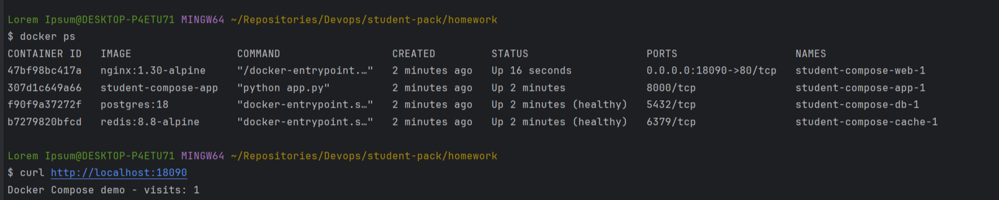

# 2. Подключим том к бд, к редису не будем. Сделаем запросы:
на / - для редиса
на /note/add и /notes - для бд

До:
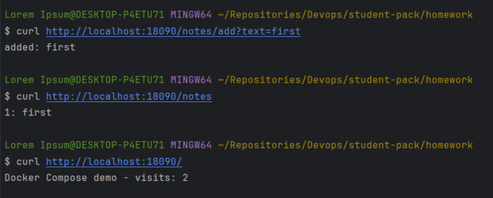

После:
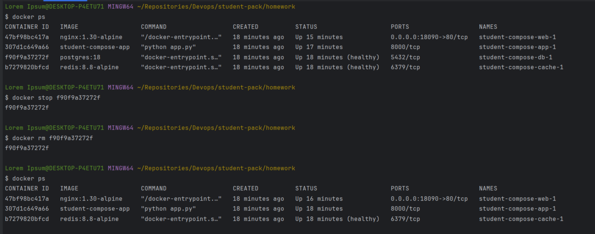

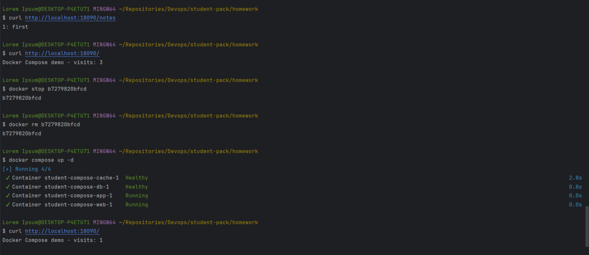

У редиса счетчик сбросился, данные по заметкам остались - они в вольюме

# 3. 
Команды:

```shell
docker compose down

# Создаем резервную копию тома
docker run --rm -v student-compose_pgdata:/data -v "$PWD/backup:/backup" alpine:3.24 tar czf /backup/student-compose_pgdata.tgz -C /data .

docker volume rm student-compose_pgdata
docker volume create student-compose_pgdata

docker run --rm -v student-compose_pgdata:/data -v "$PWD/backup:/backup" alpine:3.24 tar xzf /backup/student-compose_pgdata.tgz -C /data

```

Попытки ввести команды:
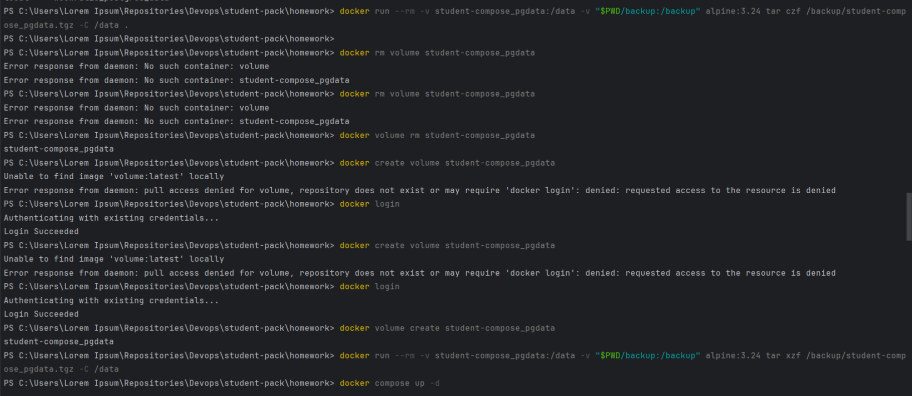

Результат не изменился: все та же одна заметка:
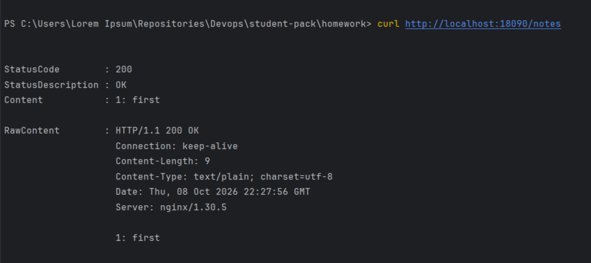

# 4. 
Проверяем nginx:

```shell
docker compose exec web sh -c 'getent hosts db || echo "db не видно"'
docker compose exec web sh -c 'getent hosts redis || echo "redis не видно"'
```

Проверяем app:
```shell
docker compose exec app getent hosts db cache
```

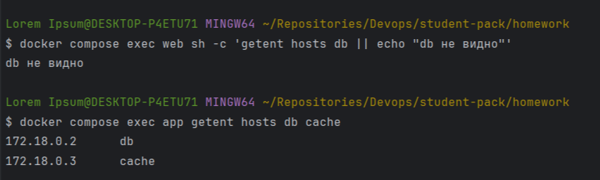

В первом случае для web не видно адреса бд и редиса, значит, и подключитсья нельзя
Для app все видно

Для проверки подключения через приложения используем 
```
docker compose exec app sh -c 'python -c "
import os, psycopg, redis
c = psycopg.connect(
    host=\"db\",
    dbname=os.environ[\"POSTGRES_DB\"],
    user=os.environ[\"POSTGRES_USER\"],
    password=os.environ[\"POSTGRES_PASSWORD\"]
)
print(\"db:\", c.execute(\"select version()\").fetchone()[0])
print(\"cache:\", redis.Redis(host=\"cache\").ping())
"'
```

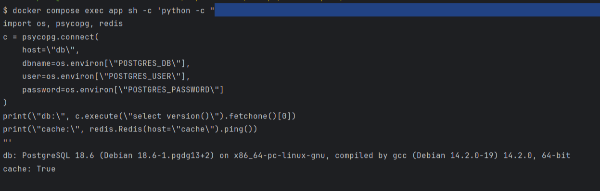

Всё хорошо. А маршрутизатором приложение не становится из-за того, 
что Docker жестко ограничивает границы возможностей сетей

# 5. 
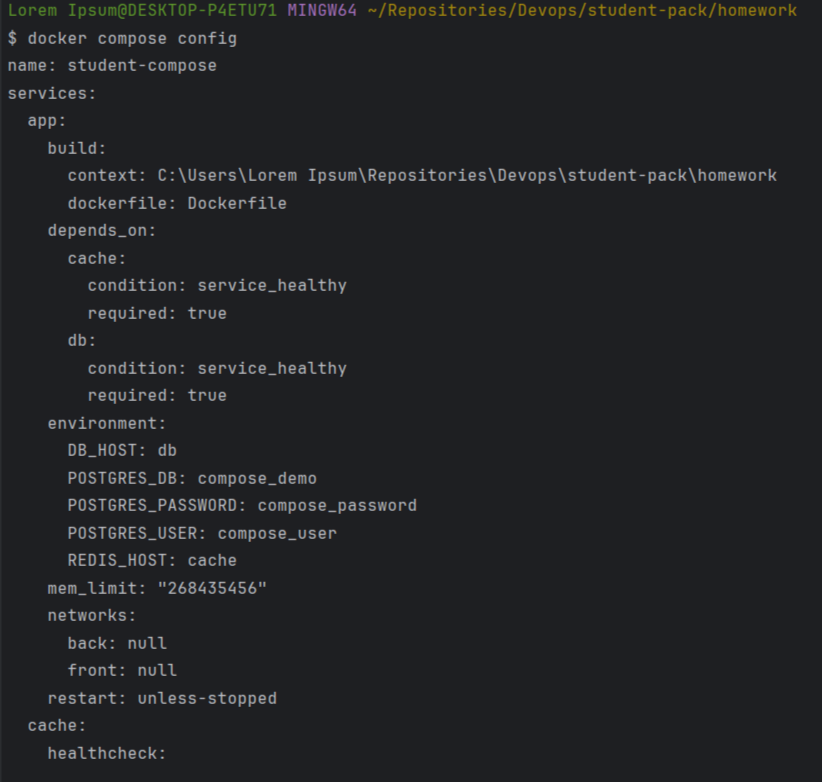

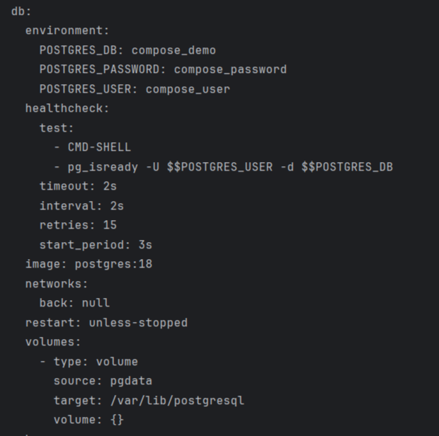

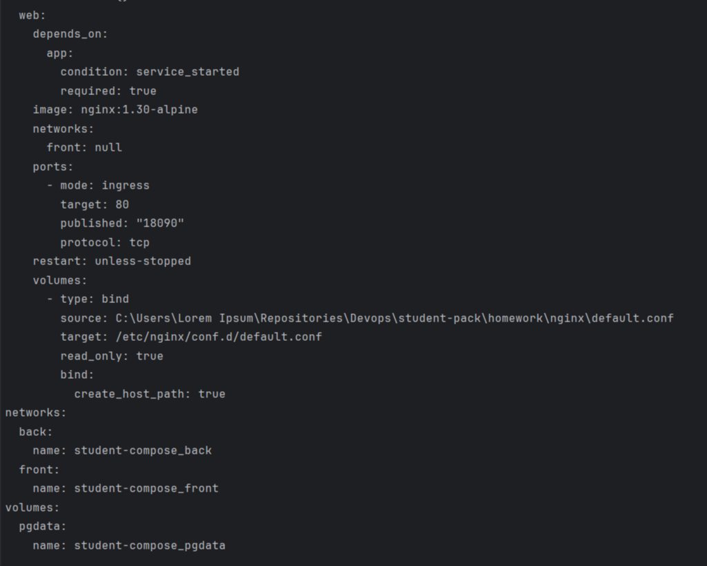

Имя проекта берется из поля name в compose.
Далее все имена строятся по шаблону:
<compose-name>_<service/volume/network-name>-<номер-реплики>

Различие между down и down -v в том, что с -v удаляются также тома. 
То есть, например, в моем проекте стерлись бы все заметки

# 6.

Для примера возьмем заведомо плохой BadDockerfile и оптимизированный Dockerfile

Вот что вывел dive для плохого Dockerfile:

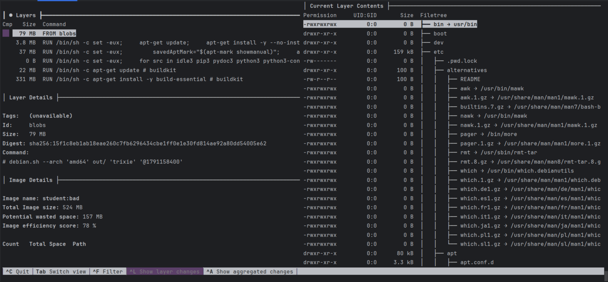

Размер: 524 МБ

```shell
CI=true dive student:bad --ci-config=.dive-ci
```
вывело

efficiency: 78.7183 % - доля полезных байтов от всех байтов образа
wastedBytes: 156661294 bytes (157 MB) - сколько байт можно потерять на удалённых и перезаписанных файлах
userWastedPercent: 35.2280 % - доля потерянного от добавленного нашими слоями


## Для оптимизированного:

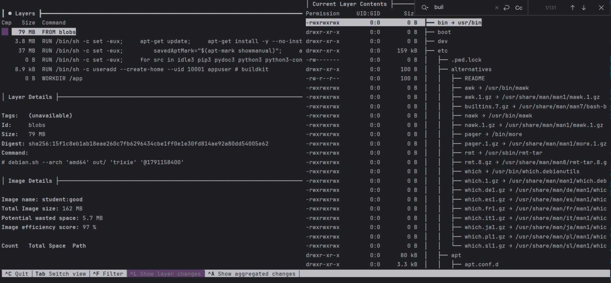

Размер: 162 МБ

```shell
CI=true dive student:good --ci-config=.dive-ci
```
вывело

efficiency: 97.5781 %
wastedBytes: 5658662 bytes (5.7 MB)
userWastedPercent: 6.7971 %

Были слои на каждую команду, теперь только 2 слоя - с установкой зависимостей и 
с созданием пользователя

Поведение не изменилось, так как логика не была затронута, все нужные пакеты остались теми же

```
dive --version
dive 0.13.1

Docker:
Client:
 Version:           27.1.1
 API version:       1.46
 Go version:        go1.21.12
 Git commit:        6312585
 Built:             Tue Jul 23 19:57:57 2024
 OS/Arch:           windows/amd64
 Context:           desktop-linux

Server: Docker Desktop 4.33.1 (161083)
 Engine:
  Version:          27.1.1
  API version:      1.46 (minimum version 1.24)
  Go version:       go1.21.12
  Git commit:       cc13f95
  Built:            Tue Jul 23 19:57:19 2024
  OS/Arch:          linux/amd64
  Experimental:     false
 containerd:
  Version:          1.7.19
  GitCommit:        2bf793ef6dc9a18e00cb12efb64355c2c9d5eb41
 runc:
  Version:          1.7.19
  GitCommit:        v1.1.13-0-g58aa920
 docker-init:
  Version:          0.19.0
  GitCommit:        de40ad0
```

# 7.

В docker-compose.override.yaml был добавлен блок в app про develop.watch. Как он работает:

При обновлении кода в app sync просто копирует код в папку. Там сервер на Flask уже
запущен с флагом --debug и при изменениях в коде перезапускается.

Но когда меняются Dockerfile или requirements.txt, то нужно прям перезапустить контейнеры.
Это в секции rebuild

Для запуска ```docker compose -f docker-compose.override.yaml up -d --watch```

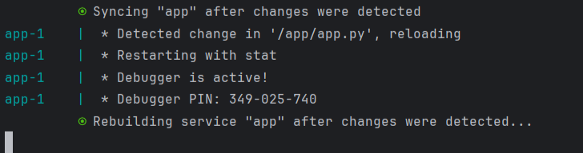

Тут сначала поменяли в app, потом в requrements.txt. В первом случае Syncing, во втором - Rebuilding.

# 7.1 

Метрики взяли из п.6 и записали пороговые значения в .dive-ci:

```
lowestEfficiency: 0.95
highestWastedBytes: 20MB
highestUserWastedPercent: 0.10
```

Файл для CI - в .github/workflows/ci.yaml

Результат - во вкладке Actions